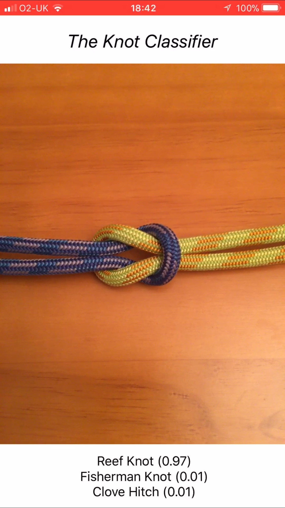
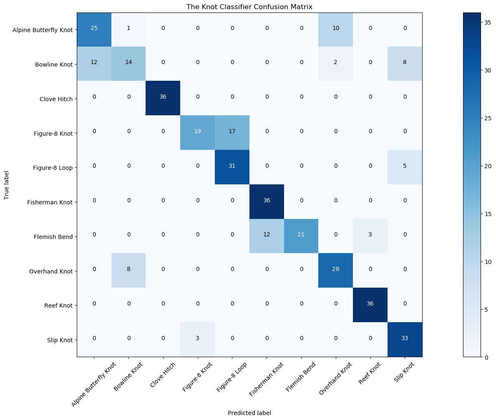
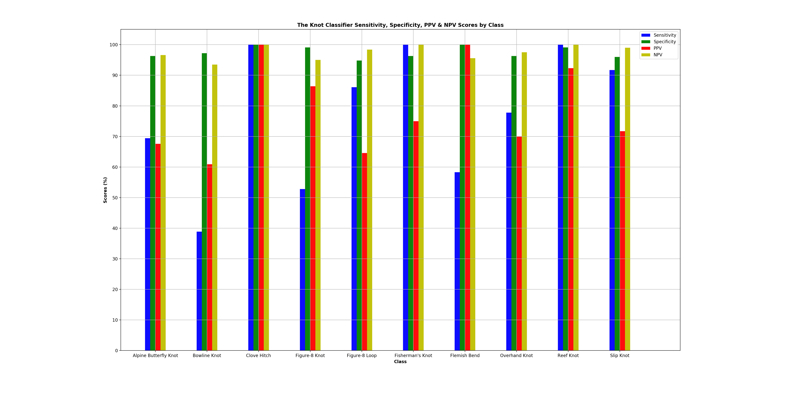
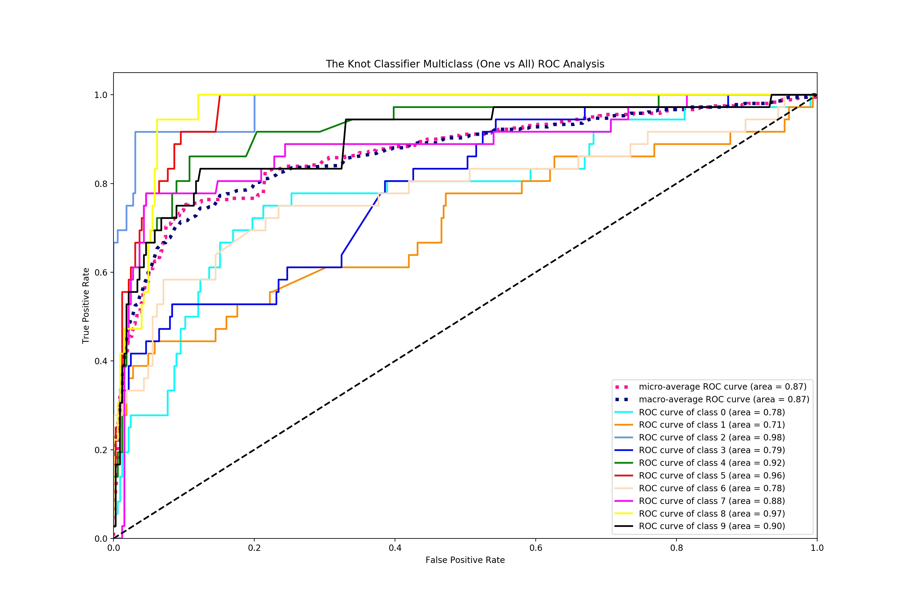

# IndividualProject - Joseph M. Cameron
## Using Machine Learning to Understand the Topology of Knots
This repository contains the code, log, meeting minutes and status reports for my individual dissertation project, which was undertaken during my 4th year at the University of Glasgow. The project was supervised by Dr John Williamson (http://www.johnhw.com).

-----------------------------------

The final dissertation PDF can be viewed and downloaded here: [Dissertation PDF](Dissertation/dissertation.pdf).
All dissertation source materials, including the final pdf, can be found in the [Dissertation](Dissertation) folder.

-----------------------------------

This project's aim is to classify knots based on their topology, from images.

Overall, this software provides the capability to classify ten knots, with the ten knots being:
* The Alpine Butterfly Knot
* The Bowline Knot
* The Clove Hitch
* The Figure-8 Knot
* The Figure-8 Loop
* The Fisherman's Knot
* The Flemish Bend
* The Overhand Knot
* The Reef Knot
* The Slip Knot

My controlled dataset containing images of these ten knots in differing conditions is available on Kaggle at https://www.kaggle.com/josephcameron/10knots.
This dataset is called 10Knots, and was used to train and validate the convolutional neural network performing knot classification.

Knot classification is achieved via a convolutional neural network implemented in Keras (with a Tensorflow backend).
The convolutional neural network training software is located within the python script [knotClassifier.py](KnotClassifier/knotClassifier.py) located in the [KnotClassifier](KnotClassifier) folder.
Upon completion of training, the knotClassifier.py script also provides many useful data visualisation plots such as a t-SNE visualisation plot, multiple training history plots and a confusion matrix plot.
This is extremely useful for evaluating the knot classifier.
Make sure to download and install the latest versions of all required pip packages including Keras (2.1.3), Tensorflow (1.3.0), sklearn, numpy, scipy, coremltools (0.8) and others to correctly run the training software.

Furthermore, an iOS application was developed to serve as an interface to utilise the trained Keras convolutional neural network to predict knots in real-time via an iPhone's camera.
The iOS application is called The Knot Classifier, and is located within the [iOSApp](iOSApp) folder as an Xcode project.
Also within this folder is the knotClassifier.mlmodel file, which is the Keras convolutional neural network that was converted to a Core ML model by the [convertModel.py](KnotClassifier/convertModel.py) script located within the [KnotClassifier](KnotClassifier) folder.
Simply drag the knotClassifier.mlmodel file into the Xcode project to use the model.
The iOS application has been implemented to run on an iPhone 6s Plus, and so the interface has been designed to match that phone's screen size.

Here is a screenshot of the Knot Classifier iOS Application in action, with the convolutional neural network model making a prediction when supplied with a real-time image of a reef knot from an iPhone camera:

A demonstration video detailing the implementation of the whole project can be found at this link: https://www.youtube.com/watch?v=OvO8Q4mA0ac.

-------------------------------------------

The following confusion matrix, which was plotted with the [plot_confusion_matrix.py](KnotClassifier/plot_confusion_matrix.py) script, visualises and gives an indication of the Knot Classifier iOS application's classification performance when given 36 random real-time images for each and every knot in similar conditions to those observed within the [10Knots dataset](https://www.kaggle.com/josephcameron/10knots):

After observing the whole confusion matrix, it can be seen that for these example real-world test images, the classifier has a top-1 classification accuracy of 77.5%.

From the same confusion matrix, it is also possible to obtain the number of true positives (TP), false negatives (FN), true negatives (TN) and false positives (FP) of each class in order to calculate the:
* Sensitivity of each class (TP/TP+FN)
* Specificity of each class (TN/TN+FP)
* Positive Predictive Value (PPV) of each class (TP/TP+FP)
* Negative Predictive Value (NPV) of each class (TN/TN+FN)

A table of the TP, FN, TN and FP values of each class from the confusion matrix is shown below in a 'one vs all' manner:

| Class (Knot) | TP | FN | TN | FP |
| ------------ | -- | -- | -- | -- |
| Alpine Butterfly Knot | 25 | 11 | 312 | 12 |
| Bowline Knot | 14 | 22 | 315 | 9 |
| Clove Hitch | 36 | 0 | 324 | 0 |
| Figure-8 Knot | 19 | 17 | 321 | 3 |
| Figure-8 Loop | 31 | 5 | 307 | 17 |
| Fisherman's Knot | 36 | 0 | 312 | 12 |
| Flemish Bend | 21 | 15 | 324 | 0 |
| Overhand Knot | 28 | 8 | 312 | 12 |
| Reef Knot | 36 | 0 | 321 | 3 |
| Slip Knot | 33 | 3 | 311 | 13 |

The calculated sensitivity, specificity, PPV and NPV values of each class are displayed and visualised in the table and bar chart below:

| Class (Knot) | Sensitivity (%) | Specificity (%) | PPV (%) | NPV (%) |
| ------------ | -- | -- | -- | -- |
| Alpine Butterfly Knot | 69.4 | 96.3 | 67.6 | 96.6 |
| Bowline Knot | 38.9 | 97.2 | 60.9 | 93.5 |
| Clove Hitch | 100 | 100 | 100 | 100 |
| Figure-8 Knot | 52.8 | 99.1 | 86.4 | 95.0 |
| Figure-8 Loop | 86.1 | 94.8 | 64.6 | 98.4 |
| Fisherman's Knot | 100 | 96.3 | 75.0 | 100 |
| Flemish Bend | 58.3 | 100 | 100 | 95.6 |
| Overhand Knot | 77.8 | 96.3 | 70.0 | 97.5 |
| Reef Knot | 100 | 99.1 | 92.3 | 100 |
| Slip Knot | 91.7 | 96.0 | 71.7 | 99.0 |

As part of the classifier's evaluation, multiclass receiver operating characteristic (ROC) analysis was achieved via the [multiclass_roc_analysis.py](KnotClassifier/multiclass_roc_analysis.py) script.
This python script produced the following ROC curves for each class from the same prediction probabilities and values seen in the confusion matrix further above:

